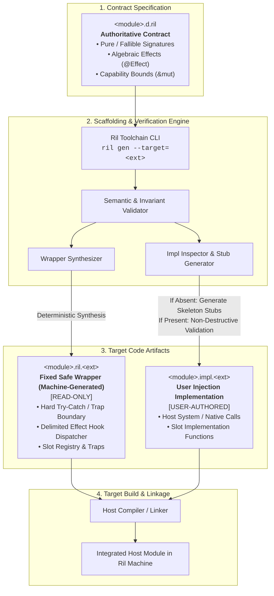

# Ril Foreign Interface Specification

**Version:** 0.1.0  
**Status:** Canonical Reference Specification  
**Format:** Code-First Normative Document  
**Domain:** External Interoperability, Slot Injection Architecture & Hard Safety Membrane  

---

## 1. Scope, Tri-File Triad & Conformance Axioms

### 1.1 The Sovereignty Axiom
> **"Only external targets adapt to Ril; Ril never adapts to them."**

1. **Zero Lexical Dialects**: Ril introduces zero foreign keywords (`extern`, `foreign`, `unsafe`, `native`). Ril source text remains strictly within its canonical 36-keyword vocabulary.
2. **Zero Foreign Compromise Types**: No dynamic or foreign-specific types (`any`, `unknown`, `void*`, `c_int`, `dyn Object`) exist in Ril. All external contracts are expressed purely in first-class Ril types (`int`, `str`, `[]T`, records, sum types, `Result<T, E>`, `Option<T>`).
3. **Target-Agnostic Boundary**: The foreign interface architecture is target-independent. It applies universally whether the compilation target is native machine code (LLVM/C), WebAssembly, or a garbage-collected host VM (JavaScript/V8, JVM, CLR).

### 1.2 The Tri-File Triad
External interoperability is decoupled across three distinct artifacts:

| Artifact | Syntactic Form | Mutation Permission | Responsibility |
| :--- | :--- | :--- | :--- |
| **Contract** | `<module>.d.ril` | User-Authored | Authoritative ABI boundary: types, pure/fallible signatures, capabilities, and algebraic effects (`@Effect`). |
| **Safe Wrapper** | `<module>.ril.<ext>` | Toolchain-Generated (Read-Only) | Canonical, sealed safety fortress: hard exception interception, argument marshalling, slot dispatchers, and effect hooks. |
| **Implementation** | `<module>.impl.<ext>` | User-Authored | Host-native implementation: executes target logic and injects functions into the safe wrapper's slots. |

---

## 2. Universal Scaffolding & Dual-Artifact Lifecycle

### 2.1 Separation of Concerns
The toolchain enforces a strict separation between the compiler-owned wrapper and the developer-owned implementation:
1. **The Safe Wrapper (`<module>.ril.<ext>`)**: Completely overwritten whenever `<module>.d.ril` changes. Developers are statically warned never to modify this file directly.
2. **The User Implementation (`<module>.impl.<ext>`)**: Scaffolded once upon initial generation. The toolchain **NEVER** overwrites existing implementation files.

### 2.2 Scaffolding Lifecycle



### 2.3 Incremental Evolution Invariant
When `<module>.d.ril` is modified:
1. `ril gen` regenerates `<module>.ril.<ext>` with updated signatures, marshaling routines, and slot tables.
2. `ril gen --update` performs semantic AST diffing against `<module>.impl.<ext>`:
   - Existing functions remain 100% untouched.
   - Missing implementation stubs are non-destructively appended to the end of `<module>.impl.<ext>`.
3. If `<module>.impl.<ext>` omits any required slot, compilation fails fast with `E0910: MissingExternalImplementationError`.

---

## 3. Slot Injection & Sealed Invariant Lifecycle

### 3.1 Slot Injection Architecture

The safe wrapper acts as an immutable shield between the Ril abstract machine and the foreign implementation. Raw foreign code never touches Ril VM internals directly; instead, it binds to discrete, guarded **Slot Descriptors**.

```mermaid
flowchart LR
    subgraph ImplDomain ["User Implementation Domain (&lt;module&gt;.impl.&lt;ext&gt;)"]
        direction TB
        RAW_FN_A["Native Function A"]
        RAW_FN_B["Native Function B"]
        INJECT_CALL["Injection Call<br/><code>inject({ A, B })</code>"]
        RAW_FN_A --> INJECT_CALL
        RAW_FN_B --> INJECT_CALL
    end

    subgraph Boundary ["Atomic Injection Boundary"]
        VALIDATOR["Signature &amp; Completeness Verifier"]
    end

    subgraph WrapperDomain ["Fixed Safe Wrapper Domain (&lt;module&gt;.ril.&lt;ext&gt;)"]
        direction TB
        SEAL["Atomic Seal (is_sealed = true)<br/>Permanent Tamper Immunity"]
        
        subgraph Slots ["Internal Slot Table"]
            SLOT_1["Slot A: TrapUnboundSlot"]
            SLOT_2["Slot B: TrapUnboundSlot"]
        end

        subgraph Membrane ["Hard Safety Membrane"]
            TRY_CATCH["Hard Try-Catch Envelope"]
            EFFECT_HOOK["Delimited Effect Hook"]
            MARSHAL["Bidirectional Marshalling"]
        end

        RIL_FACADE["Exported Ril Foreign Entry Points"]
    end

    INJECT_CALL --> VALIDATOR
    VALIDATOR --> SEAL
    SEAL -.->|"Populate Slots"| Slots
    Slots --> Membrane
    Membrane --> RIL_FACADE
```



### 3.2 Invariant State Machine

```mermaid
stateDiagram-v2
    [*] --> Unbound: Wrapper Loaded
    
    Unbound --> Binding: inject_<module>(slots) Invoked
    Unbound --> Trapped: Cross-Boundary Call Attempted
    
    Trapped --> [*]: Fault::UnboundForeignSlot (Deterministic Panic)
    
    Binding --> Rejected: Missing Slot / Signature Mismatch
    Rejected --> [*]: Abort Compilation / Load Time Error
    
    Binding --> Sealed: All Mandatory Slots Provided & Verified
    
    state Sealed {
        [*] --> SteadyState
        SteadyState --> SteadyState: Sound Guarded Invocations
    }
    
    Sealed --> RebindAttempt: Second inject_<module>() Invocation
    RebindAttempt --> Sealed: Fault::SlotAlreadyBound (Tamper Immunity)
```

#### State Definitions & Rules:
1. **Unbound State**: All slots are initialized to canonical trap stubs (`TrapUnboundSlot`). Invoking an unbound slot raises `Fault::UnboundForeignSlot` (deterministic panic), preventing null-pointer dereferences or undefined jumps.
2. **Atomic Injection**: All slots required by `<module>.d.ril` must be provided simultaneously in a single transaction. Partial binding is strictly rejected.
3. **Irreversible Sealing**: Upon successful injection, the wrapper permanently transitions to `Sealed`. Subsequent injection calls trigger `Fault::SlotAlreadyBound`, guaranteeing immunity to runtime monkey-patching.
4. **Lock-Free Concurrency**: Slot pointers are written with Release memory ordering during injection, and read with Acquire memory ordering during invocation. Once sealed, steady-state calls execute lock-free with zero contention.

---

## 4. Hard Safety Membrane Specification

### 4.1 Mandatory Safety Wrapping Invariant

> **Mandatory Safety Wrapping Invariant (Normative)**:  
> 1. **No Raw Invocations**: Direct, unshielded calls to foreign slots are strictly forbidden. Every foreign slot execution is wrapped in an impenetrable error barrier $\mathcal{B}$. Compiler optimization passes MUST NOT elide $\mathcal{B}$.  
> 2. **Hermetic Non-Escape**: External exceptions, VM traps, signals, and unwinding frames MUST NOT penetrate $\mathcal{B}$ into Ril evaluation stack frames.  
> 3. **Zero Frame Pollution**: A faulted foreign slot never leaves uninitialized, partial, or corrupted bit patterns in caller registers or stack variables.

### 4.2 Dual-Track Resolution Architecture

The wrapper evaluates foreign slot outcomes under one of two mutually exclusive tracks determined by the Ril contract signature:

```
Contract Signature:
       |
       +---> fn (...) -> Result<T, E>  [Track A: Fallible Contract]
       |        |
       |        +-- Host Trap / Exception Intercepted
       |        |     |
       |        |     +--> Matches Developer Domain Mapping?  --> Err(E)
       |        |     +--> E Accommodates Foreign Error?       --> Err(UnknownForeignError)
       |        |     +--> Unmapped & Incompatible with E?     --> Panics: ForeignDefect
       |        |
       |        +-- Normal Return -> Ok(v)
       |
       +---> fn (...) -> T             [Track B: Infallible Contract]
                |
                +-- ANY Host Exception / Trap Intercepted    --> Panics: ForeignDefect
                +-- Normal Return                            --> v
```

#### Track A: Fallible Contract (`fn ... -> Result<T, E>`)
1. **Domain Mapped Errors**: Foreign failures matching declared domain error mappings resolve to `Err(e)` where $e: E$.
2. **Default Unknown Error Synthesis**: Unmapped foreign failures:
   - If $E$ accommodates `UnknownForeignError`, the membrane synthesizes the canonical `UnknownForeignError` and yields `Err(...)`.
   - If $E$ is a closed domain error type that does not accommodate foreign runtime defects (e.g. `type AuthError { InvalidKey }`), an unexpected crash (such as `SIGSEGV` or `OOM`) escalates to a deterministic Ril Panic (`ForeignDefect`), preventing domain falsification.

#### Track B: Infallible Contract (`fn ... -> T`, where return type is not `Result`)
1. **Infallibility Assertion**: The developer asserts the slot cannot fail under valid preconditions.
2. **Deterministic Panic on ANY Fault**: If ANY host exception, signal, or trap occurs:
   - The membrane traps the fault immediately.
   - It synthesizes a canonical `UnknownForeignError` inside a `ForeignDefect` descriptor.
   - It raises a deterministic runtime panic (`panic(ForeignDefect { ... })`).
3. **Structured Scope Isolation**: The panic cannot be caught synchronously within the caller frame (§1.3), but is strictly contained at structured concurrency boundaries (`scope`), resolving to `Result<T, TaskFault::Panicked>`.

---

## 5. Target-Agnostic Default Unknown Error Model

Ril does not expose or require target-specific exception types. All foreign failures are normalized into target-agnostic Ril data structures:

```ril
-- Classification of foreign failure modes:
pub type ForeignCategory {
    Trap,               -- VM or hardware execution trap (SIGSEGV, SIGFPE, WASM trap)
    Thrown,             -- Target runtime thrown exception or unhandled error
    HostAbort,          -- Foreign process or runtime unrecoverable abort
    ResourceExhaustion, -- Target OOM or call stack exhaustion
    Unknown,            -- Unclassified foreign failure condition
}

-- Target-agnostic representation of synthesized foreign errors:
pub type UnknownForeignError = {
    slot: str,                 -- Canonical slot identifier (e.g. "platform::fs::read")
    category: ForeignCategory, -- Normalized failure classification
    message: str,              -- Normalized human-readable diagnostic message (UTF-8)
    code: ?int,                -- Normalized numeric host error/signal code if available
}

-- Payload for deterministic panics generated at the foreign membrane boundary:
pub type ForeignDefect = {
    error: UnknownForeignError,
    slot: str,
    callsite: str,
}
```

### The Normalization Pipeline ($\Phi_{\text{host}}$)
The target code-generator links an adapter $\Phi_{\text{host}}$ that projects any host failure token $\theta_{\text{host}}$ into Ril's `UnknownForeignError`:
$$\Phi_{\text{host}}(\theta_{\text{host}}, \text{slot\_id}) \longrightarrow \text{UnknownForeignError}$$

- Host error messages are sanitized into valid UTF-8 strings.
- Host integer error codes (e.g., `errno`, `HRESULT`, HTTP status) are captured in `Some(code)`.
- Host objects, raw pointers, and runtime references are discarded during boundary transition; zero foreign references escape into the Ril heap.

---

## 6. Algebraic Effect Hooks & Delimited Resumption Inversion

### 6.1 Delimited Resumption Inversion
When a foreign slot declares an algebraic effect (`@Async`, `@Fiber`, `@Effect`), the wrapper passes an **Effect Hook** to the injected implementation.

```mermaid
sequenceDiagram
    autonumber
    actor RE as Ril Engine / Abstract Machine
    participant SW as Safe Wrapper (&lt;module&gt;.ril.&lt;ext&gt;)
    participant SM as Hard Safety Membrane
    participant UI as Injected Impl (&lt;module&gt;.impl.&lt;ext&gt;)
    participant EH as Ril Effect Handler (@Effect)

    RE->>SW: Invoke Foreign Function (args)
    activate SW
    SW->>SM: Arm Error Barrier &amp; Initialize Effect Hook
    activate SM

    SM->>UI: Dispatch Slot (host_args, effect_hook)
    activate UI

    alt Normal Execution (Success)
        UI-->>SM: Return host_result
        SM-->>SW: Disarm Error Barrier
        SW-->>RE: Return Ok(val) / val
    else Algebraic Effect Invocation (@Effect)
        UI->>SM: effect_hook.yield(EffectTag, Payload)
        SM->>EH: Suspend Host Fiber &amp; Dispatch @Effect to Ril
        activate EH
        EH-->>SM: Delimited Resumption (resume_val)
        deactivate EH
        SM-->>UI: Resume Injected Impl with resume_val
        UI-->>SM: Return host_result
        SM-->>SW: Disarm Error Barrier
        SW-->>RE: Return Ok(val) / val
    else Host Exception / Crash / Trap
        UI--xSM: Host Exception / Trap
        Note over SM: Hard Safety Membrane Traps Fault!<br/>Zero Frame Pollution
        alt Fallible Contract (Result)
            SM-->>SW: Synthesize UnknownForeignError
            SW-->>RE: Return Result::Err(UnknownForeignError)
        else Infallible Contract
            SM-->>SW: Synthesize ForeignDefect
            SW--xRE: Deterministic Ril Panic (scope-contained)
        end
    end

    deactivate UI
    deactivate SM
    deactivate SW
```

### 6.2 Affine Resumption Guard (`E0610`)
Algebraic resumptions in Ril are strictly **affine (one-shot)** (§9.3). In host environments with callback-based APIs, buggy code might trigger callbacks more than once. The wrapper enforces an atomic state machine:
$$\text{State} \in \{\text{Pending}, \text{Resumed}, \text{Aborted}\}$$
Any duplicate resumption attempt is intercepted by the wrapper, which escalates `Fault::DuplicateResumeInvocationError` (`E0610`) rather than corrupting Ril's fiber scheduler.

---

## 7. Toolchain Verification & Cryptographic Provenance

To guarantee that the boundary between Ril and the foreign target cannot be modified, the toolchain embeds an immutable provenance header in generated `<module>.ril.<ext>` files:

```
// @ril-provenance: sha256:<hex_digest>
// @ril-schema:     sha256:<decl_schema_hash>
// @ril-compiler:   <version_identifier>
// @ril-mode:       canonical-fixed-wrapper
```

### Verification Pipeline:
1. **Cryptographic Integrity**: On every compilation, the toolchain verifies the SHA-256 digest of `<module>.ril.<ext>`.
2. **Canonical AST Parity**: The compiler verifies:
   $$\mathrm{NormalizeAST}(\text{OnDiskFile}) \equiv \mathrm{SynthesizeAST}(<\text{module}>.\text{d}.\text{ril})$$
3. **Tamper Rejection**: If manual edits are detected in `<module>.ril.<ext>`, compilation halts immediately with `E0905: StaleGeneratedBridgeError`.

---

## 8. Diagnostic Error Codes

| Code | Diagnostic Name | Normative Condition |
| :---: | :--- | :--- |
| **`E0901`** | `BodyInDeclModuleError` | Supplying an implementation body, variable initializer, or mutable binding in a `.d.ril` declaration unit |
| **`E0902`** | `MissingBodyInStandardModuleError` | Omitting an implementation body from a function declared in a standard `.ril` module |
| **`E0905`** | `StaleGeneratedBridgeError` | Safe wrapper artifact hash or AST does not match the `.d.ril` source declaration |
| **`E0907`** | `ForeignStructuralFieldPenetrationError` | Attempting to access fields, mutate, index, deconstruct, or instantiate an opaque external type |
| **`E0910`** | `MissingExternalImplementationError` | A symbol declared in `<module>.d.ril` is not bound in `<module>.impl.<ext>` |
| **`E0911`** | `TargetImplementationSignatureMismatchError` | An injected slot signature diverges in parameter count, types, or return type from the contract |
| **`E0920`** | `ForeignDefectPanic` | An unhandled host exception or hardware trap breached the safety membrane |

---

## 9. Normative Code-First Verification Suite

### 9.1 Contract Specification (`crypto.d.ril`)
```ril
-- In file: crypto.d.ril

pub type CipherTag = u32

pub type CryptoError {
    InvalidKeyLength(int),
    BufferExhausted,
    Foreign(UnknownForeignError),
}

-- Fallible slot: errors mapped into Result<int, CryptoError>
pub fn encrypt_block(key: []u8, mut data: []u8, tag: CipherTag) -> Result<int, CryptoError> &mut

-- Infallible slot: developer asserts hardware RNG cannot fail
pub fn random_u64() -> u64
```

### 9.2 Conceptual Safe Wrapper Pseudocode (`crypto.ril.<ext>`)
```
// CANONICAL FIXED SAFETY WRAPPER (Generated, Read-Only)
// @ril-provenance: sha256:4f8e...

type EncryptSlot = Function(Slice<u8>, MutSlice<u8>, u32) -> TargetResult<int, TargetError>
type RngSlot     = Function() -> u64

private var is_sealed = false
private var slot_encrypt: EncryptSlot = TrapUnbound("crypto::encrypt_block")
private var slot_rng:     RngSlot     = TrapUnbound("crypto::random_u64")

// Ril Entry Point: encrypt_block (Track A: Fallible)
public function ril_entry_encrypt_block(key: Slice<u8>, data: MutSlice<u8>, tag: u32) -> Result<int, CryptoError> {
    assert_valid_slice(key)
    assert_exclusive_mut_slice(data)
    
    if (!is_sealed) return raise_fault(Fault::UnboundForeignSlot("crypto::encrypt_block"))

    // Hard Safety Membrane
    try {
        let res = slot_encrypt.invoke(key, data, tag)
        if (res.is_ok) {
            return Ok(res.value)
        } else {
            // Domain mapping or default synthesis:
            if (res.error.code == 1) return Err(CryptoError::InvalidKeyLength(res.error.len))
            if (res.error.code == 2) return Err(CryptoError::BufferExhausted)
            return Err(CryptoError::Foreign(synthesize_unknown_error("crypto::encrypt_block", res.error)))
        }
    } catch (HostTrapOrException e) {
        let unk = synthesize_unknown_error("crypto::encrypt_block", e)
        return Err(CryptoError::Foreign(unk))
    }
}

// Ril Entry Point: random_u64 (Track B: Infallible)
public function ril_entry_random_u64() -> u64 {
    if (!is_sealed) raise_panic(Fault::UnboundForeignSlot("crypto::random_u64"))

    // Hard Safety Membrane: ANY trap synthesizes deterministic panic
    try {
        return slot_rng.invoke()
    } catch (HostTrapOrException e) {
        let unk = synthesize_unknown_error("crypto::random_u64", e)
        raise_panic(ForeignDefect {
            error: unk,
            slot: "crypto::random_u64",
            callsite: "crypto:random_u64:12"
        })
    }
}

// Atomic Injection API
public function inject_crypto(slots: { encrypt_block: EncryptSlot, random_u64: RngSlot }) {
    if (is_sealed) throw_fault(Fault::SlotAlreadyBound)
    if (slots.encrypt_block == null || slots.random_u64 == null) {
        throw_fault(Fault::MissingSlotImplementation)
    }
    slot_encrypt = slots.encrypt_block
    slot_rng = slots.random_u64
    is_sealed = true // Irreversible atomic seal
}
```

### 9.3 User Implementation (`crypto.impl.<ext>`)
```
// USER IMPLEMENTATION (Developer-Authored)
import { inject_crypto } from "./crypto.ril.<ext>"

function my_encrypt(key, data, tag) {
    if (key.length != 32) return TargetResult.Err({ code: 1, len: key.length })
    // In-place transformation on data...
    return TargetResult.Ok(data.length)
}

function my_rng() {
    return host_hardware_random_u64()
}

// Atomic registration into wrapper slots
inject_crypto({
    encrypt_block: my_encrypt,
    random_u64: my_rng,
})
```

### 9.4 Consumer Program & Test Suite (`app/main.ril`)
```ril
-- In file: app/main.ril
use crypto::{encrypt_block, random_u64, CryptoError}
use ril/concurrent::{scope, TaskFault}

test "fallible foreign call with domain error" {
    let bad_key: []u8 = [1, 2, 3] -- Key length != 32
    let mut payload: []u8 = [10, 20]
    
    match encrypt_block(bad_key, mut payload, 1u32) {
        Ok(_) -> panic("expected key error"),
        Err(CryptoError::InvalidKeyLength(len)) -> assert(len == 3),
        Err(CryptoError::BufferExhausted) -> panic("unexpected buffer error"),
        Err(CryptoError::Foreign(_)) -> panic("unexpected foreign error"),
    }
}

test "infallible foreign call structured panic isolation" {
    -- Infallible call executing inside structured scope:
    let outcome = scope(\mut s -> {
        let task = s.fork(\-> {
            let scoped _guard = Resource.{ name: "test_lock", on_close: \-> () }
            random_u64() -- If host RNG traps, child task panics deterministically
        })
        task.join()
    })

    match outcome {
        Ok(val) -> assert(val >= 0u64),
        Err(TaskFault::Panicked(info)) -> {
            -- Defect contained! Supervisor remains intact.
            println("Contained foreign panic: " ++ info.message)
        },
        Err(TaskFault::Cancelled) -> (),
        Err(TaskFault::DoubleFaultFatal(_)) -> (),
    }
}
```
